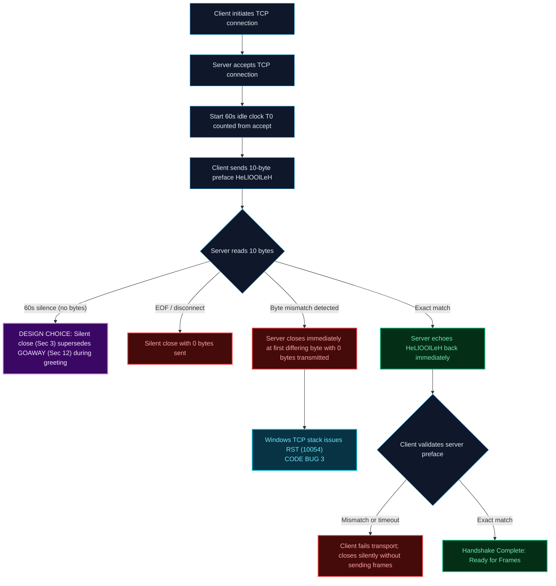
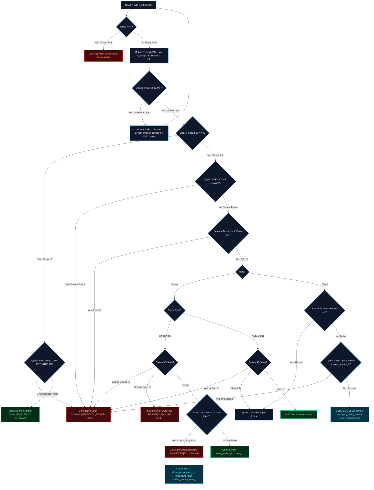
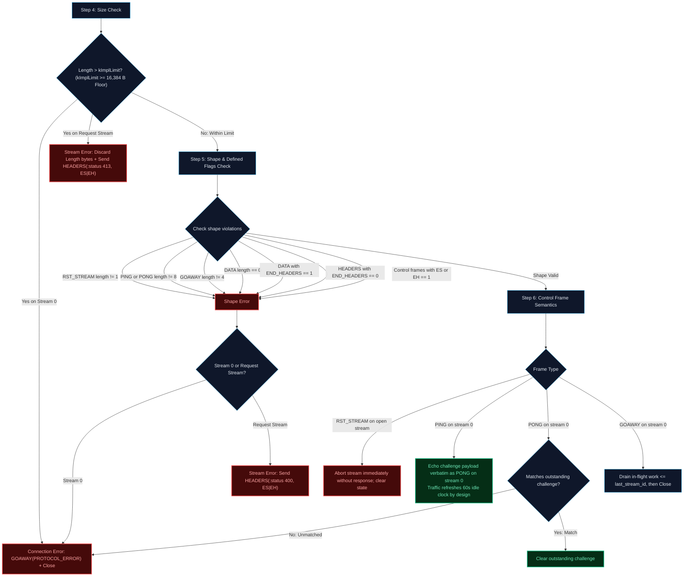
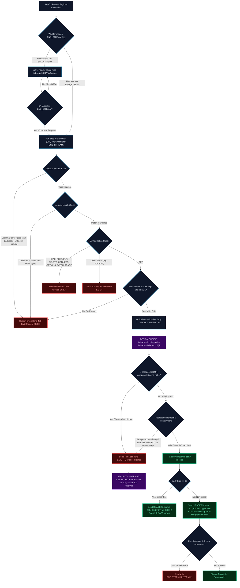
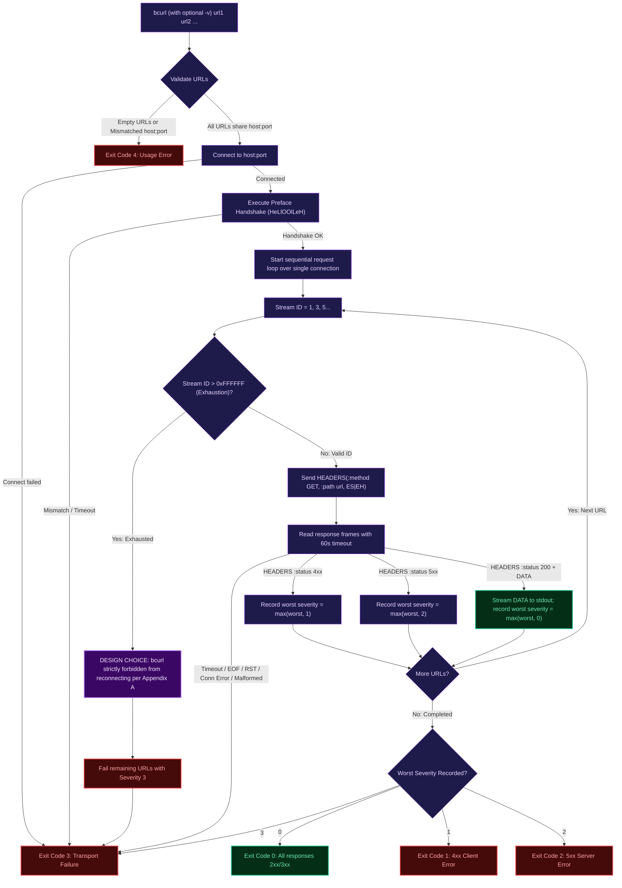

# HOOH v1 Protocol — End-to-End Decision Graph & Specification Guide

This document contains the complete, normative decision tree, architecture graph, and specification guide for the **HOOH v1** binary application protocol. It maps every state transition, framing decision, wire format, error condition, architectural design choice, and implementation hazard from the raw TCP socket to session teardown.

---

## 1. Protocol Architecture & Invariant Rules

HOOH is a binary, frame-based application protocol carrying HTTP-like request/response semantics over a single persistent TCP connection.

### Core Architectural Invariants
1. **Fixed-Size Framing**: Every message is preceded by a 7-byte binary header. Message boundaries are known before reading payloads (§4).
2. **Receiver Acceptance Floor vs Sender Cap (§4)**:
   * **Sender Cap (Removed)**: Senders are **not** capped at 16 KiB. A sender may transmit payloads up to the full 24-bit grammar ceiling of $16,777,215\text{ Bytes}$ ($16\text{ MiB} - 1$).
   * **Receiver Floor (Mandatory)**: A conforming receiver MUST accept frames up to *at least* **$16,384\text{ Bytes}$**. Above that floor, a receiver may enforce an implementation limit (`kImplLimit \ge 16,384\text{ B}`).
3. **Sequential Single-Stream Concurrency**: Only **one concurrent request stream** is permitted per connection in v1 (§7).
4. **Client-Initiated Odd Streams**: Request streams are initiated exclusively by the client using strictly increasing odd 24-bit integers ($1, 3, 5, \dots$). Even stream IDs are reserved and forbidden in v1 (§7).
5. **Connection Control on Stream 0**: Stream ID `0` is strictly reserved for connection-level control frames (`PING`, `PONG`, `GOAWAY`). It cannot carry `HEADERS`, `DATA`, or `RST_STREAM` (§7).
6. **60-Second Inactivity Timer**: Connections idle for 60 seconds of complete silence in both directions are reaped with `GOAWAY(NO_ERROR)` followed by socket closure (§12). Active wire traffic (including keepalive PING/PONG) refreshes the clock.
7. **10-Byte Preface Greeting**: Every connection begins with a strict 10-byte handshake (`HeLlOOlLeH`) echoed by the server before any frames may be sent (§3). Handshake errors close silently (superseding GOAWAY).
8. **Existence Hiding**: Server never reveals whether unauthorized, dotfile, or escaping files exist; all access denials and missing resources return uniform `404 Not Found` (§10).
9. **Reserved Status 500**: Servers are strictly forbidden from producing status 500 to prevent information oracle attacks. Disk read failures before transmission are hidden as 404, or abort the stream with `RST_STREAM(INTERNAL)` mid-stream (§10).

---

## 2. Master Integrated Continuous Workflow

The following continuous flowchart models the entire protocol execution pipeline from TCP socket creation to session termination, integrating every validation check, error branch, architectural design choice, and implementation trap.

```mermaid
flowchart TD
    classDef codeBug fill:#083344,stroke:#06b6d4,stroke-width:2px,color:#67e8f9;
    classDef specDesign fill:#3b0764,stroke:#c084fc,stroke-width:2px,color:#f3e8ff;
    classDef errNode fill:#450a0a,stroke:#ef4444,stroke-width:2px,color:#fca5a5;
    classDef okNode fill:#052e16,stroke:#10b981,stroke-width:2px,color:#6ee7b7;
    classDef stepNode fill:#0f172a,stroke:#38bdf8,stroke-width:1px,color:#e2e8f0;
    classDef clientNode fill:#1e1b4b,stroke:#a855f7,stroke-width:1px,color:#e9d5ff;

    %% STAGE 1: CONNECTION & PREFACE
    M_START["TCP Socket Connect / Accept"]:::stepNode --> M_TIMER["Initialize 60s Inactivity Timer T0"]:::stepNode
    M_TIMER --> M_PREF_SEND["Client sends HeLlOOlLeH (10 Bytes)"]:::clientNode
    M_PREF_SEND --> M_SRV_PREF_RECV{"Server receives 10 Bytes?"}:::stepNode
    
    M_SRV_PREF_RECV -->|"60s Silence"| INVARIANT_1["DESIGN CHOICE: Handshake Precedence<br/>Sec 3 silent close supersedes Sec 12 during greeting"]:::specDesign
    INVARIANT_1 --> M_SILENT_CLOSE["Silent Socket Close: 0 Bytes Sent"]:::errNode
    
    M_SRV_PREF_RECV -->|"EOF: recv == 0"| M_SILENT_CLOSE
    
    M_SRV_PREF_RECV -->|"Byte Mismatch"| M_SRV_CLOSE_NO_DATA["Server closes immediately at differing byte (0 B sent)"]:::errNode
    M_SRV_CLOSE_NO_DATA --> BUG_CODE_3["CODE BUG 3: Windows TCP RST 10054<br/>In-flight bytes trigger RST; handled in test harness"]:::codeBug
    BUG_CODE_3 --> M_TRANSPORT_FAIL["Client: Transport Failure (Severity 3)"]:::errNode
    
    M_SRV_PREF_RECV -->|"Exact Match"| M_SRV_ECHO["Server echoes HeLlOOlLeH (10 Bytes)"]:::okNode
    M_SRV_ECHO --> M_CLIENT_VAL{"Client receives echo == HeLlOOlLeH?"}:::clientNode
    
    M_CLIENT_VAL -->|"Mismatch / Timeout"| M_TRANSPORT_FAIL
    M_CLIENT_VAL -->|"Match"| M_HANDSHAKE_DONE["Preface Exchange Complete"]:::okNode
    
    %% STAGE 2: FRAME RECEPTION LOOP & 7-BYTE FIXED HEADER
    M_HANDSHAKE_DONE --> M_FRAME_LOOP["Enter Frame Processing Loop"]:::stepNode
    M_FRAME_LOOP --> M_IDLE_CHECK{"Inactivity &gt;= 60s?"}:::stepNode
    
    M_IDLE_CHECK -->|"Yes: 60s Silence"| M_IDLE_GOAWAY["Send GOAWAY(last_stream_id, NO_ERROR)<br/>Half-Close + 2s Drain + Close"]:::errNode
    M_IDLE_GOAWAY --> M_CONN_CLOSED["Connection Terminated"]:::errNode
    
    M_IDLE_CHECK -->|"No: Activity"| M_READ_HDR["Read 7-Byte Fixed Frame Header"]:::stepNode
    M_READ_HDR --> M_CHECK_EOF{"recv() == 0 or partial?"}:::stepNode
    M_CHECK_EOF -->|"EOF: 0 Bytes"| M_SILENT_CLOSE
    M_CHECK_EOF -->|"Partial Header: 1..6 Bytes"| M_TRANSPORT_FAIL
    
    M_CHECK_EOF -->|"Full 7 Bytes"| M_UNPACK["Unpack Length 24b, Type 4b, Flags 4b, StreamID 24b"]:::stepNode
    M_UNPACK --> M_STEP2_SKIP{"Step 2: Type in 0x6..0xF or unimplemented?"}:::stepNode
    
    M_STEP2_SKIP -->|"Yes: Unknown Type"| M_DISCARD_SKIP["Forward Skip: Read &amp; discard Length bytes in bounded 4 KiB chunks"]:::stepNode
    M_DISCARD_SKIP --> M_FRAME_LOOP
    
    M_STEP2_SKIP -->|"No: Known Type 0x0..0x5"| M_STEP3_S0{"Step 3: Stream ID == 0?"}:::stepNode
    
    %% STREAM 0 CONTROL BRANCH
    M_STEP3_S0 -->|"Yes: Stream 0"| M_S0_TYPE_CHECK{"Type in HEADERS, DATA, RST_STREAM?"}:::stepNode
    M_S0_TYPE_CHECK -->|"Yes: Invalid Type"| M_CONN_ERR_S0["Connection Error: GOAWAY(PROTOCOL_ERROR) + Close"]:::errNode
    M_S0_TYPE_CHECK -->|"No: Valid Control Type"| M_S0_SIZE_CHECK{"Length &gt; kImplLimit? (Floor: 16,384 B)"}:::stepNode
    M_S0_SIZE_CHECK -->|"Yes: Oversized"| M_CONN_ERR_S0
    M_S0_SIZE_CHECK -->|"No: Valid Size"| M_S0_SHAPE_CHECK{"Shape violation: PING/PONG != 8B or GOAWAY != 4B or Flags != 0?"}:::stepNode
    M_S0_SHAPE_CHECK -->|"Yes: Bad Shape"| M_CONN_ERR_S0
    M_S0_SHAPE_CHECK -->|"No: Shape OK"| M_STEP6_CTRL["Proceed to Step 6: Control Frame Semantics"]:::stepNode
    
    %% REQUEST STREAM BRANCH (STREAM ID gt 0)
    M_STEP3_S0 -->|"No: Stream ID &gt; 0"| M_NON0_TYPE_CHECK{"Type in PING, PONG, GOAWAY?"}:::stepNode
    M_NON0_TYPE_CHECK -->|"Yes: Control on Stream &gt; 0"| M_CONN_ERR_NON0["Connection Error: GOAWAY(PROTOCOL_ERROR) + Close"]:::errNode
    M_NON0_TYPE_CHECK -->|"No: Stream Frame"| M_EVEN_CHECK{"Stream ID % 2 == 0 (Even ID)?"}:::stepNode
    M_EVEN_CHECK -->|"Yes: Even ID"| M_CONN_ERR_EVEN["Connection Error: GOAWAY(PROTOCOL_ERROR) + Close"]:::errNode
    
    M_EVEN_CHECK -->|"No: Odd ID"| M_ROLE_CHECK{"Role?"}:::stepNode
    
    %% SERVER ROLE CHECKS
    M_ROLE_CHECK -->|"Server"| M_SRV_TYPE_CHECK{"Frame Type?"}:::stepNode
    
    M_SRV_TYPE_CHECK -->|"HEADERS"| M_SRV_ID_STATE{"Stream ID State?"}:::stepNode
    M_SRV_ID_STATE -->|"Gap or Closed ID"| M_CONN_ERR_REUSE["Connection Error: Stream ID Reuse<br/>GOAWAY(PROTOCOL_ERROR) + Close"]:::errNode
    M_SRV_ID_STATE -->|"Already Open ID"| M_STREAM_ERR_DUP_H["Stream Error: Duplicate Request HEADERS<br/>Send HEADERS(:status 400, ES|EH)"]:::errNode
    M_SRV_ID_STATE -->|"New ID"| M_CONCURRENCY_CHECK{"Another stream currently Open?"}:::stepNode
    
    M_CONCURRENCY_CHECK -->|"Yes: Concurrency Exceeded"| M_STREAM_ERR_CONCUR["Stream Error on New ID: Send 400 ES|EH<br/>Close New ID"]:::errNode
    M_STREAM_ERR_CONCUR --> BUG_CODE_1["CODE BUG 1: Active State Wipeout<br/>close_stream must NOT wipe open_stream_id state!"]:::codeBug
    BUG_CODE_1 --> M_ACTIVE_PRESERVED["Active Stream remains open &amp; valid"]:::okNode
    M_ACTIVE_PRESERVED --> M_FRAME_LOOP
    
    M_CONCURRENCY_CHECK -->|"No: Idle"| M_OPEN_STREAM["Open Stream State = New ID"]:::okNode
    M_OPEN_STREAM --> M_STEP4_REQ_SIZE
    
    M_SRV_TYPE_CHECK -->|"DATA / RST_STREAM"| M_SRV_DATA_STATE{"Stream ID State?"}:::stepNode
    M_SRV_DATA_STATE -->|"New or Gap ID"| M_CONN_ERR_UNOPENED["Connection Error: Frame on Unopened ID<br/>GOAWAY(PROTOCOL_ERROR) + Close"]:::errNode
    M_SRV_DATA_STATE -->|"Closed ID"| M_DISCARD_CLOSED["Ignore: Discard Length bytes"]:::stepNode
    M_DISCARD_CLOSED --> M_FRAME_LOOP
    M_SRV_DATA_STATE -->|"Open ID"| M_STEP4_REQ_SIZE
    
    %% CLIENT ROLE CHECKS
    M_ROLE_CHECK -->|"Client"| M_CLI_ABORT_CHECK{"Stream in Client-Aborted Set?"}:::clientNode
    M_CLI_ABORT_CHECK -->|"Yes: Aborted"| M_DISCARD_ABORTED["Ignore: Discard Length bytes<br/>Checked before new/gap/closed"]:::clientNode
    M_DISCARD_ABORTED --> M_FRAME_LOOP
    
    M_CLI_ABORT_CHECK -->|"No: Active"| M_CLI_HDR_CHECK{"Type == HEADERS and ID != open_stream_id?"}:::clientNode
    M_CLI_HDR_CHECK -->|"Yes: Unsolicited"| M_CONN_ERR_UNSOLICITED["Connection Error: Unsolicited HEADERS<br/>GOAWAY(PROTOCOL_ERROR) + Close"]:::errNode
    M_CLI_HDR_CHECK -->|"No: Solicited"| BUG_CODE_2["CODE BUG 2: Client Stream Sync<br/>Client must set open_client_stream upon request send"]:::codeBug
    BUG_CODE_2 --> M_STEP4_REQ_SIZE
    
    %% STAGE 3: SIZE & SHAPE VALIDATIONS (§11 STEPS 4–5)
    M_STEP4_REQ_SIZE{"Step 4: Length &gt; kImplLimit? (Floor: 16,384 B)"}:::stepNode
    M_STEP4_REQ_SIZE -->|"Yes: Oversized"| M_STREAM_ERR_413["Stream Error: Discard Length bytes<br/>Send HEADERS(:status 413, ES|EH)"]:::errNode
    M_STREAM_ERR_413 --> M_CLOSE_STREAM_413["Stream Closed; Connection Stays Open"]:::stepNode
    M_CLOSE_STREAM_413 --> M_FRAME_LOOP
    
    M_STEP4_REQ_SIZE -->|"No: Size OK"| M_STEP5_SHAPE{"Step 5: Shape &amp; Flags Check"}:::stepNode
    M_STEP5_SHAPE -->|"DATA length == 0"| M_STREAM_ERR_400["Stream Error: Send HEADERS(:status 400, ES|EH)"]:::errNode
    M_STEP5_SHAPE -->|"HEADERS without END_HEADERS"| M_STREAM_ERR_400
    M_STEP5_SHAPE -->|"DATA with END_HEADERS"| M_STREAM_ERR_400
    M_STEP5_SHAPE -->|"RST_STREAM length != 1"| M_STREAM_ERR_400
    M_STEP5_SHAPE -->|"Valid Shape &amp; Flags"| M_DISPATCH_TYPE{"Dispatch Frame Type"}:::stepNode
    
    %% STAGE 4: CONTROL FRAME SEMANTICS (STEP 6)
    M_STEP6_CTRL --> M_DISPATCH_CTRL{"Control Type"}:::stepNode
    M_DISPATCH_CTRL -->|"RST_STREAM on Stream &gt; 0"| M_RST_ACTION["Abort Open Stream Immediately<br/>No Response Sent; State Cleared"]:::errNode
    M_RST_ACTION --> M_FRAME_LOOP
    
    M_DISPATCH_CTRL -->|"PING on Stream 0"| M_PING_ACTION["Echo challenge payload verbatim as PONG on Stream 0"]:::okNode
    M_PING_ACTION --> INVARIANT_6["DESIGN CHOICE: Keepalive Wire Traffic<br/>PING resets 60s idle clock by design"]:::specDesign
    INVARIANT_6 --> M_FRAME_LOOP
    
    M_DISPATCH_CTRL -->|"PONG on Stream 0"| M_PONG_CHECK{"Challenge matches outstanding PING?"}:::stepNode
    M_PONG_CHECK -->|"No: Unmatched"| M_CONN_ERR_PONG["Connection Error: Unmatched PONG<br/>GOAWAY(PROTOCOL_ERROR) + Close"]:::errNode
    M_PONG_CHECK -->|"Yes: Matched"| M_PONG_CLEAR["Clear outstanding PING state"]:::okNode
    M_PONG_CLEAR --> M_FRAME_LOOP
    
    M_DISPATCH_CTRL -->|"GOAWAY on Stream 0"| M_GOAWAY_ACTION["Drain in-flight streams &lt;= last_stream_id, then Close"]:::stepNode
    M_GOAWAY_ACTION --> M_CONN_CLOSED
    
    %% STAGE 5: REQUEST PAYLOAD PROCESSING (STEP 7)
    M_DISPATCH_TYPE -->|"RST_STREAM"| M_RST_ACTION
    M_DISPATCH_TYPE -->|"HEADERS / DATA"| M_WAIT_ES{"Request END_STREAM seen?"}:::stepNode
    M_WAIT_ES -->|"No: More DATA"| M_BUFFER_REQ["Buffer HEADERS payload &amp; count request body bytes"]:::stepNode
    M_BUFFER_REQ --> M_FRAME_LOOP
    
    M_WAIT_ES -->|"Yes: Complete Request"| M_STEP7_EVAL["Step 7: Request Payload &amp; Path Evaluation"]:::stepNode
    
    M_STEP7_EVAL --> M_DEC_HDR{"Header Block Valid?"}:::stepNode
    M_DEC_HDR -->|"Overrun / Zero-Len / Bad Index / Unknown Pseudo"| M_STREAM_ERR_400
    
    M_DEC_HDR -->|"Valid Headers"| M_CL_CHECK{"content-length present?"}:::stepNode
    M_CL_CHECK -->|"Declared != Total DATA bytes received"| M_STREAM_ERR_400
    
    M_CL_CHECK -->|"Match or Omitted"| M_METHOD_CHECK{"Method Token?"}:::stepNode
    M_METHOD_CHECK -->|"HEAD, POST, PUT, DELETE, CONNECT, OPTIONS, PATCH, TRACE"| M_STREAM_ERR_405["Send HEADERS(:status 405, ES|EH)"]:::errNode
    M_METHOD_CHECK -->|"Other Token (e.g. FOOBAR)"| M_STREAM_ERR_501["Send HEADERS(:status 501, ES|EH)"]:::errNode
    
    M_METHOD_CHECK -->|"GET"| M_PATH_GRAMMAR{"Path starts with / and no NUL byte?"}:::stepNode
    M_PATH_GRAMMAR -->|"No: Bad Syntax"| M_STREAM_ERR_400
    
    M_PATH_GRAMMAR -->|"Yes: Valid Path"| M_LEXICAL_NORM["Lexical Normalization: Strip ?query, collapse //, resolve . and .."]:::stepNode
    M_LEXICAL_NORM --> INVARIANT_4["DESIGN CHOICE: Lexical Normalization<br/>Sec 10(d) collapses /index.html/ to /index.html"]:::specDesign
    
    INVARIANT_4 --> M_ESCAPE_CHECK{".. escapes root lexically OR component starts with .?"}:::stepNode
    M_ESCAPE_CHECK -->|"Yes: Traversal or Hidden"| M_STREAM_ERR_404["Send HEADERS(:status 404, ES|EH)<br/>Existence Hiding"]:::errNode
    
    M_ESCAPE_CHECK -->|"No: Clean Path"| M_FS_RESOLVE{"Realpath under root &amp; containment"}:::stepNode
    M_FS_RESOLVE -->|"Escapes root / missing / unreadable / FIFO / dir without index"| M_STREAM_ERR_404
    M_STREAM_ERR_404 --> INVARIANT_2["SECURITY INVARIANT: Existence Hiding<br/>Read errors masked as 404 to hide file presence; 500 reserved"]:::specDesign
    
    M_FS_RESOLVE -->|"Valid Regular File or dir/index.html"| M_SERVE_FILE["Serve 200 OK File"]:::okNode
    M_SERVE_FILE --> M_FILE_SIZE_CHECK{"File Size == 0?"}:::stepNode
    
    M_FILE_SIZE_CHECK -->|"Yes: Empty File"| M_SERVE_EMPTY["Send HEADERS(:status 200, Content-Type, ES|EH)<br/>Exactly 0 DATA frames"]:::okNode
    M_SERVE_EMPTY --> M_STREAM_COMPLETE["Stream Complete"]:::okNode
    
    M_FILE_SIZE_CHECK -->|"No: Non-Empty File"| M_SERVE_DATA["Send HEADERS(:status 200, Content-Type, EH)<br/>+ DATA Frames up to 16 MiB grammar max"]:::okNode
    M_SERVE_DATA --> M_MID_READ_SHRINK{"File shrinks / disk error mid-read?"}:::stepNode
    M_MID_READ_SHRINK -->|"Yes: Read Failure"| M_RST_INTERNAL["Send RST_STREAM(INTERNAL) to abort stream"]:::errNode
    M_MID_READ_SHRINK -->|"No: Normal Delivery"| M_STREAM_COMPLETE
    
    M_STREAM_COMPLETE --> M_FRAME_LOOP
    
    %% STAGE 6: BCURL CLIENT PIPELINE
    M_STREAM_COMPLETE -.-> M_BCURL_NEXT{"bcurl: More URLs?"}:::clientNode
    M_BCURL_NEXT -->|"Yes: Next Stream ID (1, 3, 5...)"| M_BCURL_EXHAUST{"Stream ID &gt; 0xFFFFFF?"}:::clientNode
    M_BCURL_EXHAUST -->|"Yes: Exhausted"| INVARIANT_5["DESIGN CHOICE: bcurl Single-Socket Rule<br/>Appendix A forbids reconnecting on stream exhaustion"]:::specDesign
    INVARIANT_5 --> M_FAIL_REMAINING["Fail remaining URLs with Severity 3"]:::errNode
    M_BCURL_EXHAUST -->|"No: Valid ID"| M_FRAME_LOOP
    
    M_BCURL_NEXT -->|"No: All URLs Processed"| M_BCURL_EXIT_SEV["Calculate Worst Exit Severity Seen: 4 &gt; 3 &gt; 2 &gt; 1 &gt; 0"]:::clientNode
    M_BCURL_EXIT_SEV --> M_BCURL_TERMINATE["bcurl Process Terminated"]:::clientNode
```



---

## 3. Sub-Workflow A: Connection Establishment & Preface Handshake

This sub-workflow covers the physical TCP socket establishment, the initial 60-second inactivity clock start, and the strict 10-byte magic greeting sequence exchange (§3, §12).



### Architectural Decisions:
1. **Handshake Precedence (§3)**: During the preface handshake, §3 strictly commands silent closure on error or timeout with zero bytes transmitted. No `GOAWAY` frame may be transmitted before the greeting is complete.
2. **Immediate Mismatch Closure**: At the very first differing byte, the server drops the connection immediately without waiting for remaining bytes.
3. **Windows TCP Stack Reset ([CODE BUG #3])**: Closing immediately while client send buffers have data in-flight generates a `WSAECONNRESET` (10054) on Windows. The test harness recognizes this as clean immediate rejection.

---

## 4. Sub-Workflow B: Framing, Forward Skip & Stream Routing (§11 Steps 1–3)

This sub-workflow covers reading the 7-byte fixed header, the forward-skip compatibility rule for unknown frame types, Stream 0 vs request stream classification, and the 1-stream concurrency rule (§4, §7, §11 Steps 1–3, §13).



### Critical Logic & Implementation Traps:
1. **Forward Skip Compatibility (§13)**: Unknown types in `0x6..0xF` MUST NOT terminate the connection. The receiver reads and discards `Length` bytes in bounded chunks (4 KiB) without allocating memory.
2. **Stream ID Parity (§7)**: Server-initiated streams are forbidden in v1. Any even Stream ID triggers immediate `GOAWAY(PROTOCOL_ERROR)`.
3. **1-Stream Concurrency & State Preservation ([CODE BUG #1])**:
   - When a client sends HEADERS on stream 3 while stream 1 is open, the server rejects stream 3 with `400 ES|EH`.
   - **Hazard**: If `close_stream(new_id)` unconditionally resets `current_stream_state_`, the open stream 1's state is wiped out!
   - **Fix Applied**: `Session::close_stream` strictly scopes resetting state to `if (open_stream_id_ == id)`.
4. **Client Stream Solicit Tracking ([CODE BUG #2])**:
   - `bcurl` must register `open_client_stream(id)` upon sending request HEADERS; otherwise, incoming server responses are rejected as unsolicited.

---

## 5. Sub-Workflow C: Size Bounds, Shape Validation & Control Semantics (§11 Steps 4–6)

This sub-workflow covers frame length bounds enforcement, defined flags checks, structural shape validation, and control frame dispatching (§4, §5, §6, §8, §11 Steps 4–6).



### Clarification of Size Limits (§4):
1. **Sender Cap Removed**: Senders may transmit frames up to the full $16\text{ MiB}$ grammar limit ($16,777,215\text{ Bytes}$).
2. **Receiver Acceptance Floor ($16,384\text{ Bytes}$)**: Every conforming receiver MUST accept frames up to *at least* $16,384\text{ B}$. A receiver cannot set an implementation limit lower than $16,384\text{ B}$.
3. **Receiver Implementation Limit (`kImplLimit`)**: Above the $16,384\text{ B}$ floor, a receiver may configure its limit (e.g., $1\text{ MiB}$ or $16\text{ MiB}$). Frames exceeding `kImplLimit` trigger:
   * Stream 0 $\to$ Connection Error `GOAWAY(PROTOCOL_ERROR)`.
   * Stream $>0$ $\to$ Stream Error `413 Payload Too Large` on that stream; connection remains open.
4. **Atomic Headers (§8.2)**: `HEADERS` without `END_HEADERS (0x2)` is a Stream Error 400.
5. **No Empty DATA (§8.1)**: `DATA` frames with `Length == 0` are forbidden (Stream Error 400).
6. **Keepalive Traffic Refresh (§8.4, §12)**: Outgoing and incoming PING/PONG frames constitute valid wire traffic, properly resetting the 60s idle timer to keep connections alive.

---

## 6. Sub-Workflow D: Step 7 Request Processing, Path Resolution & File Streaming

This sub-workflow covers assembling the complete request upon `END_STREAM`, decoding the header block, validating pseudo-headers, lexical path normalization, existence-hiding security checks, and streaming file bodies (§8.1, §9, §10, §11 Step 7).



### Architectural Decisions & Security Invariants:
1. **Deferred Evaluation**: Step 7 is the **only** step that waits for the request `END_STREAM` flag before evaluating payloads (§11).
2. **Grammar & Content-Length (§9)**: `content-length`, if present, must match the sum of DATA bytes received across all request frames.
3. **Lexical URL Normalization (§10(d))**: `/index.html/` is collapsed to `/index.html`, which is standard virtual URL normalization.
4. **Existence-Hiding Security Policy (§10)**:
   * To prevent information disclosure (oracle attacks where adversaries probe sensitive file existence), all missing, escaped, dotfile, and unreadable files return an anonymous `404 Not Found`.
   * **Status 500 is reserved but deliberately unproduced in v1**:
     - Pre-response disk failures are hidden as `404`.
     - Mid-stream read failures abort the stream with `RST_STREAM(INTERNAL)`.

---

## 7. Sub-Workflow E: bcurl Client Pipeline & Exit Severity Aggregation

This sub-workflow covers URL validation, the sequential execution loop over a single TCP connection, Stream ID exhaustion handling, and exit code severity arithmetic (Appendix A).



### Exit Code Severity Hierarchy:
$$\text{Exit Code} = \max(\text{severities seen}) \quad \text{where} \quad 4 > 3 > 2 > 1 > 0$$

* **Severity 4**: Command-line usage error (empty URLs, URL parse failure, or multiple distinct `host:port` pairs).
* **Severity 3**: Transport failure, preface mismatch, timeout, RST_STREAM, or framing error.
* **Severity 2**: Server error (`5xx` response status).
* **Severity 1**: Client error (`4xx` response status).
* **Severity 0**: Success (`2xx` or `3xx` status code on all URLs).

---

## 8. Node, Transition & Source Traceability Catalog

Every node across all diagrams is mapped below to its normative spec section, wire representation, and C++ source code location.

| Node ID | Node Description | Spec Clause | Wire Layout / Encoding | C++ Implementation Link |
|---|---|---|---|---|
| `M_START` | TCP Socket Connect / Accept | §2 | OS Socket Handshake | [`apps/bserve_main.cc:290-298`](file:///c:/Users/admin/OneDrive/Desktop/CODE/network-arch/HOOH/apps/bserve_main.cc#L290-L298) |
| `M_TIMER` | Inactivity Clock Initialized | §12 | Monotonic Clock $T_0$ | [`hooh/session.cc:11-14`](file:///c:/Users/admin/OneDrive/Desktop/CODE/network-arch/HOOH/hooh/session.cc#L11-L14) |
| `M_PREF_SEND` | Client Preface Send | §3 | `48 65 4c 6c 4f 4f 6c 4c 65 48` | [`hooh/session.cc:114-121`](file:///c:/Users/admin/OneDrive/Desktop/CODE/network-arch/HOOH/hooh/session.cc#L114-L121) |
| `M_SRV_PREF_RECV` | Server Preface Comparison | §3 | 10 Bytes compared | [`hooh/session.cc:137-153`](file:///c:/Users/admin/OneDrive/Desktop/CODE/network-arch/HOOH/hooh/session.cc#L137-L153) |
| `M_SRV_CLOSE_NO_DATA`| Preface Mismatch Silent Close | §3 | 0 Bytes transmitted | [`apps/bserve_main.cc:20-24`](file:///c:/Users/admin/OneDrive/Desktop/CODE/network-arch/HOOH/apps/bserve_main.cc#L20-L24) |
| `M_SRV_ECHO` | Server Preface Echo | §3 | `48 65 4c 6c 4f 4f 6c 4c 65 48` | [`hooh/session.cc:159-164`](file:///c:/Users/admin/OneDrive/Desktop/CODE/network-arch/HOOH/hooh/session.cc#L159-L164) |
| `M_FRAME_LOOP` | Active Frame Reception Loop | §4, §11 | 7-byte headers | [`apps/bserve_main.cc:33-45`](file:///c:/Users/admin/OneDrive/Desktop/CODE/network-arch/HOOH/apps/bserve_main.cc#L33-L45) |
| `M_IDLE_GOAWAY` | 60s Idle Timeout Shutdown | §8.6, §12 | `GOAWAY len=4 stream=0 [last_id][0]` | [`apps/bserve_main.cc:35-39`](file:///c:/Users/admin/OneDrive/Desktop/CODE/network-arch/HOOH/apps/bserve_main.cc#L35-L39) |
| `M_READ_HDR` | Read 7-byte Frame Header | §4, §11 Step 1 | 7 Bytes read | [`hooh/session.cc:352-358`](file:///c:/Users/admin/OneDrive/Desktop/CODE/network-arch/HOOH/hooh/session.cc#L352-L358) |
| `M_DISCARD_SKIP` | Step 2: Forward Skip | §4, §13 | Length bytes skipped | [`hooh/session.cc:245-248`](file:///c:/Users/admin/OneDrive/Desktop/CODE/network-arch/HOOH/hooh/session.cc#L245-L248) |
| `M_CONN_ERR_S0` | Step 3: Stream 0 Error | §7, §11 Step 3 | `GOAWAY len=4 stream=0 [last_id][1]` | [`hooh/session.cc:250-260`](file:///c:/Users/admin/OneDrive/Desktop/CODE/network-arch/HOOH/hooh/session.cc#L250-L260) |
| `M_CONN_ERR_EVEN` | Step 3: Even Stream ID Error | §7, §11 Step 3 | `GOAWAY len=4 stream=0 [last_id][1]` | [`hooh/session.cc:262-264`](file:///c:/Users/admin/OneDrive/Desktop/CODE/network-arch/HOOH/hooh/session.cc#L262-L264) |
| `M_CONN_ERR_REUSE`| Step 3: Stream ID Reuse Error | §7, §11 Step 3 | `GOAWAY len=4 stream=0 [last_id][1]` | [`hooh/session.cc:284-286`](file:///c:/Users/admin/OneDrive/Desktop/CODE/network-arch/HOOH/hooh/session.cc#L284-L286) |
| `M_STREAM_ERR_CONCUR`| Step 3: 1-Stream Limit (400) | §7, §11 Step 3 | `HEADERS len=6 stream=s flags=3 [:status=400]` | [`hooh/session.cc:289-293`](file:///c:/Users/admin/OneDrive/Desktop/CODE/network-arch/HOOH/hooh/session.cc#L289-L293) |
| `M_STREAM_ERR_413`| Step 4: Oversize Request (413)| §4, §11 Step 4 | `HEADERS len=6 stream=s flags=3 [:status=413]` | [`hooh/session.cc:320-325`](file:///c:/Users/admin/OneDrive/Desktop/CODE/network-arch/HOOH/hooh/session.cc#L320-L325) |
| `M_STREAM_ERR_400`| Step 5: Shape Violation (400) | §6, §11 Step 5 | `HEADERS len=6 stream=s flags=3 [:status=400]` | [`hooh/session.cc:327-345`](file:///c:/Users/admin/OneDrive/Desktop/CODE/network-arch/HOOH/hooh/session.cc#L327-L345) |
| `M_RST_ACTION` | Step 6: RST_STREAM Abort | §8.3 | `RST_STREAM len=1 stream=s [err]` | [`hooh/session.cc:107-113`](file:///c:/Users/admin/OneDrive/Desktop/CODE/network-arch/HOOH/hooh/session.cc#L107-L113) |
| `M_PING_ACTION` | Step 6: PING/PONG Echo | §8.4, §8.5 | `PONG len=8 stream=0 [challenge: 8B]` | [`apps/bserve_main.cc:80-87`](file:///c:/Users/admin/OneDrive/Desktop/CODE/network-arch/HOOH/apps/bserve_main.cc#L80-L87) |
| `M_STEP7_EVAL` | Step 7: Request Evaluation | §8.2, §11 Step 7 | Triggered on END_STREAM | [`apps/bserve_main.cc:127-135`](file:///c:/Users/admin/OneDrive/Desktop/CODE/network-arch/HOOH/apps/bserve_main.cc#L127-L135) |
| `M_STREAM_ERR_405`| Step 7: Disallowed Method | §10 | `HEADERS len=6 stream=s flags=3 [:status=405]` | [`apps/bserve_main.cc:160-168`](file:///c:/Users/admin/OneDrive/Desktop/CODE/network-arch/HOOH/apps/bserve_main.cc#L160-L168) |
| `M_STREAM_ERR_501`| Step 7: Unknown Method | §10 | `HEADERS len=6 stream=s flags=3 [:status=501]` | [`apps/bserve_main.cc:170-175`](file:///c:/Users/admin/OneDrive/Desktop/CODE/network-arch/HOOH/apps/bserve_main.cc#L170-L175) |
| `M_STREAM_ERR_404`| Step 7: Existence Hiding (404)| §10 | `HEADERS len=6 stream=s flags=3 [:status=404]` | [`hooh/pathutil.cc:75-120`](file:///c:/Users/admin/OneDrive/Desktop/CODE/network-arch/HOOH/hooh/pathutil.cc#L75-L120) |
| `M_SERVE_EMPTY` | 200 OK Empty File (0 DATA) | §8.2, §10 | `HEADERS len=... stream=s flags=3` | [`hooh/fileserve.cc:29-37`](file:///c:/Users/admin/OneDrive/Desktop/CODE/network-arch/HOOH/hooh/fileserve.cc#L29-L37) |
| `M_SERVE_DATA` | 200 OK Chunked Body Stream | §8.1, §10 | `HEADERS flags=2` + `DATA flags=1` | [`hooh/fileserve.cc:45-85`](file:///c:/Users/admin/OneDrive/Desktop/CODE/network-arch/HOOH/hooh/fileserve.cc#L45-L85) |
| `M_BCURL_NEXT` | bcurl Sequential Execution | Appendix A | Requests over streams 1, 3, 5... | [`apps/bcurl_main.cc:150-185`](file:///c:/Users/admin/OneDrive/Desktop/CODE/network-arch/HOOH/apps/bcurl_main.cc#L150-L185) |
| `M_BCURL_EXIT_SEV`| bcurl Worst Exit Severity | Appendix A | Exit Code 0, 1, 2, 3, 4 | [`apps/bcurl_main.cc:320-325`](file:///c:/Users/admin/OneDrive/Desktop/CODE/network-arch/HOOH/apps/bcurl_main.cc#L320-L325) |

---

## 9. Implementation Traps & Protocol Architecture Design

### Part A: Code Bugs & Implementation Traps (Identified & Resolved)

#### [CODE BUG #1] `close_stream` Active State Wipeout
* **Location in Graph**: Master & Sub-Workflow B (`BUG_CODE_1`).
* **Source**: [`hooh/session.cc:213-218`](file:///c:/Users/admin/OneDrive/Desktop/CODE/network-arch/HOOH/hooh/session.cc#L213-L218).
* **The Hazard**:
  When a client sent a HEADERS frame opening stream 3 while stream 1 was already open, the server correctly rejected stream 3 with 400. However, invoking `close_stream(3)` unconditionally executed `current_stream_state_ = StreamState{};` despite `open_stream_id_` being 1.
* **The Consequence**:
  Stream 1's active header payload buffer was completely wiped out. When stream 1's subsequent DATA frame arrived, the server treated stream 1 as stream 0, causing a catastrophic state corruption.
* **The Verified Fix**:
  ```cpp
  void Session::close_stream(uint32_t id) {
      if (open_stream_id_ == id) {
          open_stream_id_ = 0;
          current_stream_state_ = StreamState{}; // ONLY reset when closing active stream!
      }
      mark_id_used(id);
  }
  ```

---

#### [CODE BUG #2] Client Stream Sync Desync
* **Location in Graph**: Master & Sub-Workflow B (`BUG_CODE_2`).
* **Source**: [`hooh/session.cc:94-100`](file:///c:/Users/admin/OneDrive/Desktop/CODE/network-arch/HOOH/hooh/session.cc#L94-L100) and [`apps/bcurl_main.cc:163`](file:///c:/Users/admin/OneDrive/Desktop/CODE/network-arch/HOOH/apps/bcurl_main.cc#L163).
* **The Hazard**:
  When `bcurl` sent request HEADERS, the client session did not transition `open_stream_id_` to the new stream ID. When the server replied with response HEADERS, `classify_frame` saw `s != open_stream_id_` and concluded the server sent HEADERS on an unopened stream, triggering `GOAWAY(PROTOCOL_ERROR)`.
* **The Verified Fix**:
  Added [`Session::open_client_stream(id)`](file:///c:/Users/admin/OneDrive/Desktop/CODE/network-arch/HOOH/hooh/session.cc#L94-L100) and invoked it immediately upon client HEADERS transmission in `bcurl`.

---

#### [CODE BUG #3] Windows TCP RST 10054 on Immediate Close
* **Location in Graph**: Master & Sub-Workflow A (`BUG_CODE_3`).
* **Source**: [`tests/conformance.py:202-210`](file:///c:/Users/admin/OneDrive/Desktop/CODE/network-arch/HOOH/tests/conformance.py#L202-L210).
* **The Hazard**:
  Under §3 preface mismatch at byte 1, the server closes the socket immediately while the client send buffer still has in-flight bytes. On Windows, this raises `ConnectionResetError` (WSAECONNRESET 10054) instead of clean FIN.
* **The Verified Fix**:
  Test harness updated to recognize connection reset as valid confirmation of immediate closure with 0 transmitted bytes.

---

### Part B: Protocol Design Choices & Security Invariants

#### 1. Handshake Precedence vs Idle Reaping (§3 vs §12)
* **Design Choice**: §3 explicitly commands: *"Until the exchange completes... both peers close silently on any error or timeout; no GOAWAY is sent before the greeting is done."*
* **Architecture**: The greeting phase strictly supersedes §12's `GOAWAY(NO_ERROR)` rule. A peer experiencing 60s silence before the handshake completes terminates silently with 0 bytes transmitted.

---

#### 2. Existence-Hiding Security Policy & Reserved Status 500 (§10)
* **Security Invariant**: Standard web servers often reveal information via distinct 404, 403, and 500 error responses, creating oracle vulnerabilities where attackers probe internal file presence and disk permissions.
* **Architecture**: HOOH v1 strictly hides all missing, unreadable, escaping, dotfile, and traversal errors under a uniform `404 Not Found` response. Status `500` is reserved but intentionally unproduced in v1; disk read failures before response start return `404`, and read failures after response start abort the stream with `RST_STREAM(INTERNAL)`.

---

#### 3. Uniform Error Frame Wire Invariant (§10)
* **Wire Invariant**: All error responses (400, 404, 405, 413, 501) MUST consist of exactly one HEADERS frame containing only `:status`, flags `END_HEADERS|END_STREAM`, and no body bytes.
* **Architecture**: Senders cannot attach `content-length: 0` or error descriptions on the wire. This ensures byte-level frame uniformity across all error occurrences.

---

#### 4. Lexical URL Normalization (§10(d))
* **Design Choice**: §10(d) mandates: *"the remainder is normalized lexically... removing a trailing slash ('/' stays '/'); for example '/index.html/' becomes '/index.html'"*.
* **Architecture**: Path normalization collapses trailing slashes to regular files, standard for POSIX-like virtual URL file systems.

---

#### 5. bcurl Strict Single-Connection Mandate (Appendix A)
* **Design Choice**: While §7 allows general protocol clients to open a new connection upon 24-bit stream ID exhaustion, Appendix A explicitly commands that `bcurl` never opens a second connection.
* **Architecture**: Enforces the project's strict "one socket per invocation" constraint. Remaining URLs upon exhaustion are failed with Severity 3.

---

#### 6. Keepalive Liveness Traffic Refresh (§8.4, §12)
* **Design Choice**: §12 specifies that traffic in either direction resets the 60s idle clock.
* **Architecture**: PING and PONG frames constitute valid wire traffic, allowing peers to send periodic keepalive probes to prevent idle timeouts from reaping active persistent connections.

---

#### 7. Receiver Acceptance Floor vs Sender Cap (§4)
* **Design Choice**:
  * The 16 KiB sender cap was removed from the specification, allowing senders to stream up to the full $16\text{ MiB}$ grammar max ($16,777,215\text{ B}$).
  * In response, the **$16,384\text{ B}$ Receiver Acceptance Floor** was added: all conforming receivers MUST accept payloads up to *at least* $16,384\text{ B}$ without rejecting them as oversized.
* **Architecture**: Above the $16,384\text{ B}$ floor, receivers enforce `kImplLimit`. This guarantees baseline interoperability while allowing servers to handle large frames.

---

## 10. Test Coverage & Verification Matrix

| Category | Test Suite & Name | Scenarios & Behaviors Verified | Result |
|---|---|---|---|
| **Golden Reference** | [`tests/test_golden.cc`](file:///c:/Users/admin/OneDrive/Desktop/CODE/network-arch/HOOH/tests/test_golden.cc) | §15 Golden byte-exact request & response frame sequence | **PASS** |
| **Unit Tests** | [`tests/test_unit.cc:test_frame_encoding`](file:///c:/Users/admin/OneDrive/Desktop/CODE/network-arch/HOOH/tests/test_unit.cc) | 7-byte fixed header pack/unpack, little-endian 24b/16b integers | **PASS** |
| **Unit Tests** | [`tests/test_unit.cc:test_header_block`](file:///c:/Users/admin/OneDrive/Desktop/CODE/network-arch/HOOH/tests/test_unit.cc) | Static table 1..10 encoding/decoding, literals, duplicate headers | **PASS** |
| **Unit Tests** | [`tests/test_unit.cc:test_path_normalization`](file:///c:/Users/admin/OneDrive/Desktop/CODE/network-arch/HOOH/tests/test_unit.cc) | Query stripping, `..` traversal, trailing slash normalization | **PASS** |
| **Socket Conformance** | `test_preface_exact_echo` | §3 Exact 10-byte handshake echo | **PASS** |
| **Socket Conformance** | `test_preface_mismatch_closes_silent` | §3 Mismatch at byte 1 closes immediately with 0 bytes transmitted | **PASS** |
| **Socket Conformance** | `test_preface_mismatch_byte5` | §3 Mismatch at byte 5 closes immediately with 0 bytes transmitted | **PASS** |
| **Socket Conformance** | `test_preface_short_eof` | §3 Partial preface followed by EOF closes silently | **PASS** |
| **Socket Conformance** | `test_unknown_frame_type_forward_skip` | §13 Unknown frame type 0x7 skipped in bounded chunks | **PASS** |
| **Socket Conformance** | `test_stream0_stream_level_frame_rejected`| §7, §11 Step 3: HEADERS on Stream 0 triggers `GOAWAY(PROTOCOL_ERROR)` | **PASS** |
| **Socket Conformance** | `test_even_stream_id_rejected` | §7 Even stream ID triggers `GOAWAY(PROTOCOL_ERROR)` | **PASS** |
| **Socket Conformance** | `test_stream_id_reuse_rejected` | §7 Reusing closed stream ID triggers `GOAWAY(PROTOCOL_ERROR)` | **PASS** |
| **Socket Conformance** | `test_stream_id_gap_reuse_rejected` | §7 Sending HEADERS on skipped gap ID triggers `GOAWAY(PROTOCOL_ERROR)` | **PASS** |
| **Socket Conformance** | `test_data_on_unopened_stream_rejected` | §11 Step 3: DATA on unopened stream triggers `GOAWAY(PROTOCOL_ERROR)` | **PASS** |
| **Socket Conformance** | `test_concurrency_limit_400` | §7 1-stream concurrency: Stream 3 rejected with 400; Stream 1 intact | **PASS** |
| **Socket Conformance** | `test_oversize_frame_413` | §4, §11 Step 4: Frame > 16 KiB triggers 413; connection stays open | **PASS** |
| **Socket Conformance** | `test_empty_data_frame_rejected` | §6, §8.1: DATA length == 0 triggers 400 | **PASS** |
| **Socket Conformance** | `test_headers_without_end_headers_rejected`| §8.2: HEADERS without END_HEADERS triggers 400 | **PASS** |
| **Socket Conformance** | `test_data_with_end_headers_rejected` | §5: DATA with END_HEADERS flag triggers 400 | **PASS** |
| **Socket Conformance** | `test_ping_pong_echo` | §8.4, §8.5: PING on Stream 0 echoed verbatim as PONG | **PASS** |
| **Socket Conformance** | `test_rst_stream_aborts_active_stream` | §8.3: RST_STREAM aborts open stream without response | **PASS** |
| **Socket Conformance** | `test_rst_stream_on_closed_stream_ignored`| §11 Step 3: RST_STREAM on closed stream silently ignored | **PASS** |
| **Socket Conformance** | `test_get_root_serves_index` | §10 Root `/` serves `index.html` with Content-Type | **PASS** |
| **Socket Conformance** | `test_get_empty_file_zero_data_frames` | §10 Empty file produces 200 HEADERS with exactly 0 DATA frames | **PASS** |
| **Socket Conformance** | `test_get_404_existence_hiding` | §10 Missing file, dotfile, or traversal returns 404 ES|EH | **PASS** |
| **Socket Conformance** | `test_method_not_allowed_405` | §10 POST returns 405 Method Not Allowed ES|EH | **PASS** |
| **Socket Conformance** | `test_method_not_implemented_501` | §10 FOOBAR returns 501 Not Implemented ES|EH | **PASS** |
| **Socket Conformance** | `test_content_length_mismatch_400` | §9 Declared content-length != received DATA bytes returns 400 | **PASS** |
| **Socket Conformance** | `test_pseudo_after_regular_header_400` | §9 Pseudo-header after regular header returns 400 | **PASS** |
| **Socket Conformance** | `test_unknown_pseudo_header_400` | §9 Unknown pseudo-header `:authority` returns 400 | **PASS** |
| **Socket Conformance** | `test_missing_method_400` | §9 Missing `:method` pseudo-header returns 400 | **PASS** |
| **Socket Conformance** | `test_duplicate_method_400` | §9 Duplicate `:method` pseudo-header returns 400 | **PASS** |
| **Socket Conformance** | `test_path_starting_without_slash_400` | §10 Path not starting with `/` returns 400 | **PASS** |
| **Client Test Suite** | `test_bcurl_single_url_success` | Appendix A: bcurl streams 200 response to stdout (Exit Code 0) | **PASS** |
| **Client Test Suite** | `test_bcurl_404_severity_1` | Appendix A: bcurl 404 response sets Severity 1 (Exit Code 1) | **PASS** |
| **Client Test Suite** | `test_bcurl_501_severity_2` | Appendix A: bcurl 501 response sets Severity 2 (Exit Code 2) | **PASS** |
| **Client Test Suite** | `test_bcurl_connection_refused_severity_3`| Appendix A: bcurl TCP connect failure sets Severity 3 (Exit Code 3) | **PASS** |
| **Client Test Suite** | `test_bcurl_preface_mismatch_severity_3` | Appendix A: Server preface mismatch sets Severity 3 (Exit Code 3) | **PASS** |
| **Client Test Suite** | `test_bcurl_rst_stream_severity_3` | Appendix A: Server RST_STREAM sets Severity 3 (Exit Code 3) | **PASS** |
| **Client Test Suite** | `test_bcurl_sequential_multiple_urls` | Appendix A: Sequential URLs over single connection (Exit Code 0) | **PASS** |
| **Client Test Suite** | `test_bcurl_mixed_severities_worst_wins` | Appendix A: 200 + 404 + 501 -> Worst severity wins (Exit Code 2) | **PASS** |
| **Client Test Suite** | `test_bcurl_usage_error_severity_4` | Appendix A: Mismatched host:port across URLs (Exit Code 4) | **PASS** |
